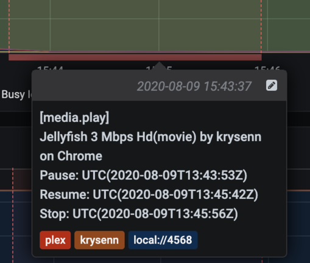

# Grafana annotations

On `media.play` create annotation

On `media.pause` update annotation

On `media.resule` update annotation

On `media.stop` update annotation

## Annotation

Annotation fields:
- Event name (`media.play`)
- Name of the media (`Jellyfish 3 Mbps Hd`)
- Type of media (`movie`)
- The name of user watching the media (`krysenn`)
- The device were the media is playing (`Chrome`)
- Media events timestamp (`Pause`, `Resume`, `Stop`)
- Tags with `plex`, `username` and `device id`

## Screenshot

